# Sistema de Growth Orgánico - Labortrovilo 🚀

Conjunto completo de features de crecimiento orgánico para escalar Labortrovilo sin paid ads.

## 📋 Tabla de Contenidos

- [Resumen Ejecutivo](#resumen-ejecutivo)
- [SEO Dinámico](#seo-dinámico)
- [Social Sharing Images](#social-sharing-images)
- [Sistema de Referidos](#sistema-de-referidos)
- [Public Job Board](#public-job-board)
- [Métricas y Analytics](#métricas-y-analytics)
- [Roadmap de Growth](#roadmap-de-growth)

---

## 🎯 Resumen Ejecutivo

Implementamos 4 pilares de crecimiento orgánico:

| Pilar | Objetivo | Métrica Clave | Impacto Esperado |
|-------|----------|---------------|------------------|
| **SEO Dinámico** | Tráfico orgánico de Google | Organic sessions | +300% en 6 meses |
| **Social Sharing** | Viralidad en redes | Share rate | CTR +15% |
| **Referidos** | User acquisition | Referral rate | 25% new users |
| **Public Board** | Lead generation | Conversion rate | 10% sign-ups |

### ROI Estimado

```
Inversión: 0€ en ads
Costo: Solo desarrollo (ya hecho)
Retorno:
- 5000+ usuarios orgánicos/mes (mes 6)
- 500+ usuarios premium convertidos
- $10k+ MRR adicional
```

---

## 🔍 SEO Dinámico

### Implementación

**Archivo:** [src/seo_router.py](src/seo_router.py)

Genera automáticamente:
1. **Sitemap.xml** con 500+ URLs
2. **Robots.txt** optimizado
3. **Meta tags** dinámicos por oferta
4. **JSON-LD** para Google for Jobs

### Endpoints

```python
GET /sitemap.xml
GET /robots.txt
GET /seo/job/{job_id}
GET /seo/tech/{tech_name}
```

### URLs Generadas

#### Landing Pages por Tecnología
```
/vagas/python       → Top 50 techs
/vagas/javascript
/vagas/react
/vagas/typescript
...
```

**Estrategia:**
- Genera 50 landing pages automáticamente
- Cada página con título SEO optimizado
- Meta description única
- Contenido dinámico basado en DB

**Ejemplo de Title:**
```
247 Vagas de Python - Labortrovilo | Salarios Competitivos
```

#### Landing Pages por Ubicación
```
/vagas/buenos-aires  → Top 30 locations
/vagas/sao-paulo
/vagas/remoto
...
```

#### Landing Pages por Modalidad
```
/vagas/remoto
/vagas/hibrido
/vagas/presencial
```

### Structured Data (JSON-LD)

Cada oferta tiene schema.org/JobPosting:

```json
{
  "@context": "https://schema.org/",
  "@type": "JobPosting",
  "title": "Senior Python Developer",
  "description": "...",
  "datePosted": "2024-01-15T10:00:00Z",
  "employmentType": "FULL_TIME",
  "hiringOrganization": {
    "@type": "Organization",
    "name": "TechCorp"
  },
  "jobLocation": {
    "@type": "Place",
    "address": {
      "addressLocality": "Buenos Aires",
      "addressCountry": "AR"
    }
  },
  "baseSalary": {
    "@type": "MonetaryAmount",
    "currency": "USD",
    "value": "$120k - $150k"
  }
}
```

**Beneficio:** Aparece en Google for Jobs automáticamente.

### Meta Tags por Oferta

```html
<!-- Basic SEO -->
<title>Senior Python Developer - TechCorp</title>
<meta name="description" content="💼 Senior Python Developer en TechCorp. 🔧 Python, Django, AWS, Docker. 📍 Buenos Aires. Aplica ahora!" />

<!-- Open Graph (Facebook, LinkedIn) -->
<meta property="og:type" content="website" />
<meta property="og:title" content="Senior Python Developer - TechCorp" />
<meta property="og:description" content="..." />
<meta property="og:image" content="https://labortrovilo.com/api/social-image/job/123" />
<meta property="og:url" content="https://labortrovilo.com/job/123" />

<!-- Twitter Card -->
<meta name="twitter:card" content="summary_large_image" />
<meta name="twitter:title" content="..." />
<meta name="twitter:image" content="https://labortrovilo.com/api/social-image/job/123" />
```

### Robots.txt Optimizado

```
User-agent: *
Allow: /
Allow: /vagas/
Allow: /job/
Disallow: /api/
Disallow: /admin/
Crawl-delay: 2

User-agent: Googlebot
Crawl-delay: 1

Sitemap: https://labortrovilo.com/sitemap.xml
```

**Beneficios:**
- Google indexa ofertas rápidamente
- LinkedIn/Twitter bots tienen acceso
- Protege endpoints privados

### Implementación en Frontend

```jsx
// App.js
import { Helmet } from 'react-helmet';

function JobDetailPage({ job, seoData }) {
  return (
    <>
      <Helmet>
        <title>{seoData.meta_tags.title}</title>
        <meta name="description" content={seoData.meta_tags.description} />
        <meta property="og:image" content={seoData.meta_tags['og:image']} />
        {/* ...más meta tags */}
        
        {/* Structured Data */}
        <script type="application/ld+json">
          {JSON.stringify(seoData.structured_data)}
        </script>
      </Helmet>
      
      {/* Contenido del job */}
    </>
  );
}
```

---

## 🎨 Social Sharing Images

### Implementación

**Archivo:** [src/social_images.py](src/social_images.py)

Genera imágenes Open Graph (1200x630px) dinámicas usando **Pillow**.

### Endpoints

```python
GET /api/social-image/job/{job_id}
GET /api/social-image/tech/{tech_name}
```

### Diseño de Imagen (Job)

```
+-------------------------------------------------------+
| 🏢 TechCorp                        Labortrovilo       |
|                                                       |
|                                                       |
| 💼 Senior Python Developer                           |
|                                                       |
| 📍 Buenos Aires  |  💰 $120k - $150k USD             |
|                                                       |
| 🔧 [Python] [Django] [AWS] [Docker] [React]          |
|                                                       |
|                                                       |
| ⭐ Growth Score: 8.7/10           1847 ofertas        |
+-------------------------------------------------------+
```

**Features:**
- Logo de empresa (si disponible)
- Tech stack en badges
- Growth Score calculado
- Colores dark theme de Labortrovilo

### Diseño de Imagen (Tech Landing)

```
+-------------------------------------------------------+
|                                                       |
|                                                       |
|              🐍 PYTHON JOBS                           |
|                                                       |
|          ╔════════════════════╗                       |
|          ║   247 ofertas      ║                       |
|          ║   Actualizadas hoy ║                       |
|          ╚════════════════════╝                       |
|                                                       |
|        Labortrovilo - Growth Platform                 |
+-------------------------------------------------------+
```

### Growth Score Algorithm

```python
def calculate_growth_score(job: Job) -> float:
    score = 5.0  # Base
    
    # Salario competitivo (+2)
    if "$100k+" in job.salary_range:
        score += 2.0
    
    # Tech stack moderno (+2)
    modern_techs = ["Python", "React", "TypeScript", "Kubernetes", "AWS"]
    matches = len([t for t in job.tech_stack if t in modern_techs])
    score += min(matches * 0.4, 2.0)
    
    # Remoto (+1.5)
    if "remoto" in job.modality.lower():
        score += 1.5
    
    # Publicado recientemente (+1.5)
    if days_since_posted <= 7:
        score += 1.5
    
    # Description completa (+1)
    if len(job.description) > 200:
        score += 1.0
    
    return min(score, 10.0)
```

### Tech Emojis

```python
emoji_map = {
    "python": "🐍",
    "javascript": "⚡",
    "react": "⚛️",
    "docker": "🐳",
    "kubernetes": "☸️",
    "aws": "☁️",
    # ...
}
```

### Uso en Redes Sociales

Cuando alguien comparte un job en LinkedIn/Twitter:

**Antes (sin imagen):**
```
https://labortrovilo.com/job/123
→ Plain link, no preview
```

**Después (con imagen):**
```
https://labortrovilo.com/job/123
→ Beautiful card with:
   - Company logo
   - Job title
   - Tech stack
   - Growth Score
   - Call to action
```

**CTR esperado:** +15-20%

---

## 👥 Sistema de Referidos

### Implementación

**Archivo:** [src/referral_system.py](src/referral_system.py)  
**Frontend:** [src/components/ReferralDashboard.jsx](src/components/ReferralDashboard.jsx)

Modelo **Dropbox-style**: Ambos usuarios (referrer y referred) reciben recompensas.

### Mecánica

```mermaid
sequenceDiagram
    participant Referrer
    participant System
    participant NewUser
    
    Referrer->>System: Genera código LAB-XY7K9M2P
    Referrer->>NewUser: Comparte código (email/social)
    NewUser->>System: Signup con código
    System->>NewUser: +50 créditos API inmediatos
    System->>System: Espera validación (7 días)
    NewUser->>System: Actividad (3+ búsquedas)
    System->>Referrer: +50 créditos API
    System->>Referrer: Notificación "Tu referido validó!"
```



### Endpoints

```python
GET  /api/v1/user/referral
GET  /api/v1/user/referral/stats
POST /api/v1/user/referral/apply
GET  /api/v1/user/referral/leaderboard
GET  /api/v1/user/referral/history
GET  /api/v1/user/admin/referral/stats [ADMIN]
```

### Recompensas

```python
REFERRAL_REWARDS = {
    "referrer_credits": 50,      # Para quien refiere
    "referred_credits": 50,      # Para nuevo usuario
}
```

**Valor:** 50 créditos = $3.50 USD (según pricing)

### Condiciones de Validación

Para que el referrer reciba sus 50 créditos:

```python
REFERRAL_CONDITIONS = {
    "min_activity_days": 7,      # 7 días activo
    "min_searches": 3,           # Al menos 3 búsquedas
    "email_verified": True,      # Email verificado
}
```

**Por qué:** Evita abuso (crear cuentas fake).

### Gamificación

#### Badges

| Referidos | Badge | Emoji |
|-----------|-------|-------|
| 5 | Bronce | 🥉 |
| 10 | Plata | 🥈 |
| 25 | Oro | 🥇 |
| 50 | Platino | 🏆 |
| 100 | Diamante | 💎 |

#### Leaderboard

Top 10 referrers visibles públicamente:

```
#1  Carlos M.     💎 Diamante    127 referidos    6350 créditos
#2  Ana R.        🏆 Platino     89 referidos     4450 créditos
#3  Miguel S.     🏆 Platino     67 referidos     3350 créditos
...
```

**Incentivo:** Social proof + competencia sana.

### Dashboard de Referidos

Componente React con:

1. **Código único grande** (LAB-XY7K9M2P)
2. **URL de invitación** con botón copiar
3. **Social share buttons** (Twitter, LinkedIn, Facebook, Email)
4. **Estadísticas:**
   - Total de referidos
   - Créditos ganados
   - Referidos pendientes de validación
   - Posición en leaderboard
5. **Historial de referidos:**
   - Email, fecha registro, tier, estado (validado/pendiente)
6. **"¿Cómo funciona?"** section explicativa

### Social Sharing

Botones pre-configurados:

**Twitter:**
```
🚀 ¡Únete a Labortrovilo y recibe 50 créditos API gratis! 
Usa mi código: LAB-XY7K9M2P
https://labortrovilo.com/signup?ref=LAB-XY7K9M2P
```

**LinkedIn:**
Similar, tono más profesional.

### Modelo de Base de Datos

```python
class User(Base):
    # ...campos existentes...
    
    # Sistema de Referidos
    referral_code = Column(String(20), unique=True, index=True)
    referred_by_id = Column(Integer, ForeignKey("users.id"))
    referral_credits_earned = Column(Integer, default=0)
    total_referrals = Column(Integer, default=0)
    
    # Relación self-referential
    referrer = relationship("User", remote_side=[id], backref="referrals")
```

### CRON Job de Validación

```python
# scheduler.py
@scheduler.scheduled_job('cron', hour=3, minute=0)
def validate_pending_referrals():
    """
    Ejecuta diariamente a las 3AM
    Valida referidos que cumplieron 7 días
    Otorga recompensas pendientes
    Envía notificaciones
    """
    process_pending_referrals(db_session)
```

---

## 🌍 Public Job Board

### Implementación

**Archivo:** [src/public_router.py](src/public_router.py)

Vista pública **sin autenticación** para maximizar indexación SEO.

### Endpoints

```python
GET /api/v1/public/jobs
GET /api/v1/public/jobs/{job_id}
GET /api/v1/public/tech/{tech_name}
GET /api/v1/public/search-suggestions
GET /api/v1/public/stats
```

### Lead Magnet Strategy

**Mostrar:**
- ✅ Título de oferta
- ✅ Empresa (puede ser "Confidencial")
- ✅ Ubicación
- ✅ Tech stack
- ✅ Description preview (200 chars)
- ✅ Growth Score

**Bloquear (requiere registro):**
- 🔒 Salario completo (muestra "Competitivo")
- 🔒 Botón "Aplicar" → Modal de registro
- 🔒 URL de aplicación directa
- 🔒 Red Flags IA
- 🔒 Detalles de empresa

### Salary Preview

```python
def get_salary_preview(salary_range: str) -> str:
    if "$100k+" in salary_range:
        return "$100k+ 🔒"
    elif "$80k+" in salary_range:
        return "$80k+ 🔒"
    else:
        return "Competitivo 🔒"
```

**Objetivo:** Generar curiosidad → Click en "Ver salario" → Modal de registro.

### Modal de Registro (Frontend)

```jsx
{showLoginModal && (
  <div className="modal">
    <h2>🔒 Contenido Premium</h2>
    <p>Regístrate gratis para ver:</p>
    <ul>
      <li>✅ Salario completo</li>
      <li>✅ Aplicar directamente</li>
      <li>✅ Red Flags IA</li>
      <li>✅ Alertas personalizadas</li>
    </ul>
    <button>Registrarse Gratis</button>
    <p className="small">Ya tienes cuenta? <a>Iniciar sesión</a></p>
  </div>
)}
```

### Conversion Funnel

```
Public Job Board (no auth)
    ↓
Ver preview de oferta
    ↓
Click "Ver Salario" o "Aplicar"
    ↓
Modal de registro
    ↓
Signup (con código de referido opcional)
    ↓
Usuario registrado
    ↓
Ve salario completo + puede aplicar
```

**Tasa de conversión esperada:** 10-15%

### Search Suggestions (Autocomplete)

```python
GET /api/v1/public/search-suggestions?q=python

Response:
{
  "technologies": [
    {"name": "Python", "count": 247},
    {"name": "Python Flask", "count": 45}
  ],
  "companies": [
    {"name": "Python Software Foundation", "count": 3}
  ],
  "locations": [
    {"name": "Buenos Aires", "count": 89}
  ]
}
```

**Beneficio:** Mejora UX, reduce bounce rate.

### Public Stats (Homepage)

```python
GET /api/v1/public/stats

Response:
{
  "total_active_jobs": 1847,
  "total_companies": 423,
  "jobs_added_today": 47,
  "jobs_this_week": 312,
  "top_technologies": [
    {"name": "Python", "count": 247},
    {"name": "JavaScript", "count": 198},
    ...
  ],
  "last_updated": "2024-01-15T10:30:00Z"
}
```

**Uso en Homepage:**
```jsx
<div className="stats-banner">
  <h2>📊 En Tiempo Real</h2>
  <div className="stat-cards">
    <div className="stat">
      <span className="number">1847</span>
      <span className="label">Ofertas Activas</span>
    </div>
    <div className="stat">
      <span className="number">47</span>
      <span className="label">Añadidas Hoy</span>
    </div>
    <div className="stat">
      <span className="number">423</span>
      <span className="label">Empresas</span>
    </div>
  </div>
</div>
```

**Objetivo:** FOMO (Fear of Missing Out) → Genera urgencia para registrarse.

---

## 📊 Métricas y Analytics

### KPIs de Growth

#### SEO

| Métrica | Baseline | Mes 1 | Mes 3 | Mes 6 | Objetivo |
|---------|----------|-------|-------|-------|----------|
| Organic Sessions | 100 | 500 | 2000 | 5000 | 10k |
| Ranking Keywords | 50 | 200 | 800 | 2000 | 5k |
| Indexed Pages | 10 | 500 | 1000 | 1500 | 2k |
| DA (Domain Authority) | 10 | 15 | 25 | 35 | 40 |

**Tools:** Google Search Console, Ahrefs, SEMrush

#### Social Sharing

| Métrica | Baseline | Mes 1 | Mes 3 | Objetivo |
|---------|----------|-------|-------|----------|
| Share Rate | 0.5% | 2% | 5% | 10% |
| CTR from Social | 3% | 5% | 8% | 12% |
| LinkedIn Impressions | 1k | 10k | 50k | 100k |

**Tools:** Twitter Analytics, LinkedIn Analytics, UTM tracking

#### Referidos

| Métrica | Baseline | Mes 1 | Mes 3 | Objetivo |
|---------|----------|-------|-------|----------|
| Total Referrers | 0 | 50 | 200 | 500 |
| Total Referred | 0 | 75 | 400 | 1000 |
| Validation Rate | - | 60% | 75% | 80% |
| Viral Coefficient | 0 | 0.3 | 0.5 | 1.0 |

**Fórmula Viral Coefficient:**
```
K = (% invitaciones enviadas) × (tasa conversión) × (promedio invitaciones/user)

Ejemplo:
K = 0.40 × 0.15 × 5 = 0.3

Si K > 1.0 → Crecimiento viral exponencial
```

#### Public Board

| Métrica | Baseline | Mes 1 | Mes 3 | Objetivo |
|---------|----------|-------|-------|----------|
| Public Page Views | 100 | 1000 | 5000 | 10k |
| Signup Conversion | - | 8% | 12% | 15% |
| Bounce Rate | 70% | 60% | 50% | 40% |

### Event Tracking

```javascript
// Google Analytics / Mixpanel events

// SEO
trackEvent('seo_tech_landing_view', { tech: 'python' });
trackEvent('sitemap_accessed');

// Social Sharing
trackEvent('social_share', { platform: 'twitter', job_id: 123 });
trackEvent('og_image_generated', { job_id: 123 });

// Referral
trackEvent('referral_code_copied');
trackEvent('referral_code_applied', { code: 'LAB-XYZ' });
trackEvent('referral_validated', { referrer_id: 456 });

// Public Board
trackEvent('public_job_viewed', { job_id: 123, source: 'google' });
trackEvent('login_modal_shown', { trigger: 'salary_click' });
trackEvent('public_to_signup_conversion');
```

### A/B Testing

#### Experimento 1: CTA en Public Board

**Variante A (Control):**
```
🔒 Regístrate gratis para ver salario completo
```

**Variante B (Beneficio social):**
```
🚀 Únete a 5,000+ profesionales que ya usan Labortrovilo
```

**Métrica:** Signup conversion rate  
**Duración:** 2 semanas  
**Sample size:** 1000 visitantes por variante

#### Experimento 2: Referral Rewards

**Variante A (Control):** 50 créditos

**Variante B (Mayor recompensa):** 100 créditos

**Métrica:** Referral rate  
**Hipótesis:** Doble recompensa → +30% invitaciones

---

## 🚀 Roadmap de Growth

### Fase 1: Foundation (Mes 1-2)

- [x] SEO: Sitemap dinámico
- [x] SEO: Meta tags por oferta
- [x] Social: Generador de imágenes OG
- [x] Referral: Sistema base con recompensas
- [x] Public: Vista sin auth
- [ ] Analytics: Event tracking setup
- [ ] A/B: Framework de testing (Google Optimize)

### Fase 2: Optimization (Mes 3-4)

- [ ] SEO: Blog content (50 posts)
- [ ] SEO: Internal linking automation
- [ ] Social: LinkedIn bot para auto-share
- [ ] Referral: Email drip campaign
- [ ] Public: Landing pages dinámicas (100+)
- [ ] Analytics: Conversion funnel optimization
- [ ] A/B: 5 experimentos simultáneos

### Fase 3: Scaling (Mes 5-6)

- [ ] SEO: Guest posting (50 backlinks)
- [ ] Social: Influencer partnerships
- [ ] Referral: Leaderboard con premios físicos
- [ ] Public: Multi-idioma (EN, PT)
- [ ] Analytics: Predictive modeling
- [ ] A/B: Personalization engine

### Fase 4: Advanced (Mes 7-12)

- [ ] SEO: Topic clusters (10 clusters)
- [ ] Social: User-generated content
- [ ] Referral: Tiered rewards (Bronze/Silver/Gold)
- [ ] Public: API pública para integraciones
- [ ] Analytics: ML-powered recommendations
- [ ] A/B: Automated testing with AI

---

## 🎯 Mejores Prácticas

### SEO

1. **Content is King:**
   - Publicar 2-3 blog posts/semana
   - Tópicos: "Guía salarial Python 2024", "Mejores empresas tech LATAM"
   
2. **Technical SEO:**
   - Core Web Vitals < 2s
   - Mobile-first design
   - Schema.org markup
   
3. **Link Building:**
   - Guest posts en blogs tech
   - Partnerships con universidades
   - Resource pages ("Tools for devs")

### Social Sharing

1. **Optimize OG Images:**
   - Test A/B con diferentes diseños
   - Añadir logo de empresa real (scraping o API)
   - Growth Score destacado
   
2. **Social Proof:**
   - "X personas compartieron esto"
   - Testimonials en Twitter embeds
   
3. **CTA Claro:**
   - "Aplica en 2 clicks"
   - "Ver salarios reales"

### Referral

1. **Incentivos:**
   - Early access a nuevas features
   - Swag (camisetas, stickers)
   - Top referrer del mes: 500 créditos extra
   
2. **Friction Reduction:**
   - 1-click sharing
   - Pre-filled messages
   - Auto-apply código en signup
   
3. **Gamificación:**
   - Badges visibles en perfil
   - Leaderboard actualizado real-time
   - Challenges mensuales

### Public Board

1. **Lead Magnets Efectivos:**
   - Salary Report anual (descargable)
   - Tech Skills Demand Report
   - "Red Flags Checklist" PDF
   
2. **Progressive Disclosure:**
   - Mostrar más info conforme scroll
   - Lazy load de imágenes
   
3. **Urgency & Scarcity:**
   - "23 aplicantes en las últimas 24h"
   - "Publicado hace 2 días"

---

## 📚 Recursos Adicionales

### Tools Recomendadas

- **SEO:** Ahrefs, SEMrush, Google Search Console
- **Analytics:** Google Analytics, Mixpanel, Amplitude
- **A/B Testing:** Google Optimize, Optimizely
- **Heatmaps:** Hotjar, Crazy Egg
- **Social Monitoring:** Hootsuite, Buffer

### Lecturas Recomendadas

- **SEO:** "The Art of SEO" (O'Reilly)
- **Growth:** "Hacking Growth" (Sean Ellis)
- **Viral:** "Contagious" (Jonah Berger)
- **Metrics:** "Lean Analytics" (Alistair Croll)

### Case Studies

1. **Dropbox Referral Program:** 60% signups via referral
2. **Airbnb Social Sharing:** +300% growth con Craigslist integration
3. **Buffer SEO Strategy:** 100k+ organic visits/mes con content

---

**Implementado con ❤️ para Labortrovilo**  
**Growth Engineering v1.0 - Diciembre 2024**
