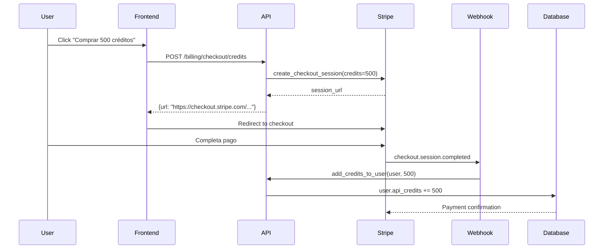

# Sistema de Monetización de Labortrovilo 💰

Sistema completo de pagos, suscripciones y créditos API integrado con Stripe.

## 📋 Tabla de Contenidos

- [Resumen Ejecutivo](#resumen-ejecutivo)
- [Arquitectura](#arquitectura)
- [Tiers de Suscripción](#tiers-de-suscripción)
- [Sistema de Créditos API](#sistema-de-créditos-api)
- [Configuración de Stripe](#configuración-de-stripe)
- [Endpoints de la API](#endpoints-de-la-api)
- [Webhooks](#webhooks)
- [Rate Limiting](#rate-limiting)
- [Frontend](#frontend)
- [Testing](#testing)
- [Troubleshooting](#troubleshooting)

---

## 🎯 Resumen Ejecutivo

Labortrovilo implementa un modelo de monetización de 3 tiers:

1. **FREE** - Acceso gratuito limitado (5 búsquedas/día)
2. **CANDIDATO_PREMIUM** - $19.99/mes - Búsquedas ilimitadas + IA
3. **HR_PRO_PLAN** - $99.99/mes - Todo + API access con créditos

### Pricing Modelo

| Feature | FREE | CANDIDATO_PREMIUM | HR_PRO_PLAN |
|---------|------|-------------------|-------------|
| **Precio** | $0 | $19.99/mes ($199.90/año) | $99.99/mes ($999.90/año) |
| **Búsquedas diarias** | 5 | Ilimitadas | Ilimitadas |
| **Alertas tiempo real** | ❌ | ✅ | ✅ |
| **Red Flags IA** | ❌ | ✅ | ✅ |
| **Filtros avanzados** | ❌ | ✅ | ✅ |
| **Intelligence Insights** | ❌ | ✅ | ✅ |
| **API Access** | ❌ | ❌ | ✅ |
| **Créditos API** | 0 | 0 | 1000 incluidos |
| **Export datasets** | ❌ | ❌ | ✅ |
| **Market Intelligence** | ❌ | ❌ | ✅ |

---

## 🏗️ Arquitectura

```
┌─────────────────────────────────────────────────────────────────┐
│                        Frontend (React)                          │
│  PricingPlans.jsx  │  CreditBalance.jsx  │  BillingDashboard    │
└───────────────────────┬─────────────────────────────────────────┘
                        │ REST API calls
                        ↓
┌─────────────────────────────────────────────────────────────────┐
│                    FastAPI Backend                               │
│  src/billing_router.py  │  src/middleware.py                    │
│  src/payments.py (StripeManager)                                │
└───────────────────────┬─────────────────────────────────────────┘
                        │
        ┌───────────────┼───────────────┐
        │               │               │
        ↓               ↓               ↓
┌─────────────┐  ┌──────────┐  ┌────────────────┐
│   SQLite    │  │  Stripe  │  │  Stripe        │
│   Database  │  │  API     │  │  Webhooks      │
│   (User,    │  │          │  │  (async sync)  │
│    Sub,     │  │          │  │                │
│    Trans)   │  │          │  │                │
└─────────────┘  └──────────┘  └────────────────┘
```

### Componentes Principales

#### 1. **models.py** - Database Schema

```python
# Enums
SubscriptionTier: FREE, CANDIDATO_PREMIUM, HR_PRO_PLAN
SubscriptionStatus: ACTIVE, CANCELED, PAST_DUE, INCOMPLETE, TRIALING

# User model extended with:
- subscription_tier (default: FREE)
- subscription_status (default: ACTIVE)
- stripe_customer_id
- stripe_subscription_id
- api_credits (default: 0)
- api_credits_used (default: 0)
- daily_searches (default: 0)
- daily_search_limit (default: 5)
- last_search_reset

# New tables:
- Subscription: Complete Stripe subscription history
- Transaction: Payment audit trail
```

#### 2. **src/payments.py** - StripeManager

```python
class StripeManager:
    """Gestiona todas las operaciones de Stripe"""
    
    # Métodos principales:
    - create_customer(user) -> str
    - create_checkout_session(user, tier, interval) -> dict
    - activate_subscription(user, stripe_subscription)
    - cancel_subscription(user, immediately=False)
    - update_subscription_tier(user, new_tier)
    - create_credit_purchase_session(user, credits_amount) -> dict
    - add_credits_to_user(user, credits, transaction_id)
    - deduct_credits(user, credits, description) -> bool
    - check_daily_search_limit(user) -> bool
    - increment_daily_searches(user)
    - get_subscription_info(user) -> dict
    - get_transaction_history(user, limit) -> List[Transaction]
```

#### 3. **src/stripe_webhooks.py** - Webhook Handler

```python
# Eventos manejados:
@router.post("/webhooks/stripe")
- checkout.session.completed → Activa suscripción o añade créditos
- customer.subscription.updated → Sincroniza estado de suscripción
- customer.subscription.deleted → Revierte a FREE tier
- invoice.payment_succeeded → Registra renovación
- invoice.payment_failed → Marca PAST_DUE
```

#### 4. **src/middleware.py** - Rate Limiting

```python
# Decorators disponibles:
@check_daily_search_limit
    - Valida límite de 5 búsquedas/día para FREE
    - Auto-reset a medianoche
    
@check_api_credits(credits_required=N)
    - Valida balance de créditos API
    - Descuenta créditos automáticamente
    - Solo para HR_PRO_PLAN
    
@check_subscription_active
    - Bloquea si suscripción PAST_DUE/CANCELED
    - Respeta período de gracia
    
@require_tier(SubscriptionTier.XXX)
    - Valida tier mínimo requerido
```

#### 5. **src/billing_router.py** - API Endpoints

```python
# Endpoints públicos:
GET  /api/v1/billing/pricing
POST /api/v1/billing/checkout/subscription
POST /api/v1/billing/checkout/credits

# Endpoints autenticados:
GET  /api/v1/billing/subscription
POST /api/v1/billing/subscription/cancel
POST /api/v1/billing/subscription/upgrade
GET  /api/v1/billing/credits/balance
GET  /api/v1/billing/search-quota
GET  /api/v1/billing/transactions

# Endpoints admin:
GET  /api/v1/billing/admin/subscriptions
GET  /api/v1/billing/admin/revenue
```

---

## 💎 Tiers de Suscripción

### FREE Tier

**Precio:** $0

**Límites:**
- 5 búsquedas por día (reset automático a medianoche)
- Sin acceso a Intelligence Insights
- Sin alertas en tiempo real
- Sin Red Flags IA

**Uso típico:**
```python
# Validación automática en endpoints de búsqueda
@app.get("/api/v1/jobs/search")
@check_daily_search_limit
def search_jobs(current_user: User = Depends(get_current_user)):
    # Si el usuario es FREE y agotó sus 5 búsquedas, recibe 429
    ...
```

### CANDIDATO_PREMIUM

**Precio:** 
- Mensual: $19.99/mes
- Anual: $199.90/año (ahorro del 16%)

**Features:**
- ✅ Búsquedas ilimitadas
- ✅ Alertas en tiempo real (email, Slack, Discord)
- ✅ Red Flags IA detecta problemas en ofertas
- ✅ Favoritos y guardar búsquedas
- ✅ Filtros avanzados
- ✅ Intelligence Insights

**Upgrade flow:**
```javascript
// Frontend
const handleUpgrade = async () => {
  const session = await api.billing.createCheckoutSession('CANDIDATO_PREMIUM', 'monthly');
  window.location.href = session.url; // Redirige a Stripe Checkout
};
```

### HR_PRO_PLAN

**Precio:**
- Mensual: $99.99/mes
- Anual: $999.90/año (ahorro del 16%)

**Features:**
- ✅ Todo de CANDIDATO_PREMIUM
- ✅ API access completo
- ✅ 1000 créditos API incluidos mensuales
- ✅ Export datasets (JSON/CSV)
- ✅ Hiring Signals en tiempo real
- ✅ Market Intelligence reports
- ✅ Bright Data integration

**Cálculo de créditos:**
```python
# Costo por operación:
- 1 crédito = 1 registro individual
- 10 créditos = dataset completo (export JSON/CSV)
- 5 créditos = análisis IA de candidato
- 20 créditos = Market Intelligence report

# Ejemplo:
user.api_credits = 1000  # Incluidos con suscripción
# Exporta dataset de 500 jobs
deduct_credits(user, 10, "Dataset export")
# Balance: 990 créditos
```

---

## 🔑 Sistema de Créditos API

### Pricing de Créditos

Los usuarios HR_PRO pueden comprar créditos adicionales:

| Pack | Precio | Precio/Crédito | Ahorro |
|------|--------|----------------|--------|
| 100 créditos | $9.99 | $0.0999 | - |
| 500 créditos | $39.99 | $0.0799 | 20% |
| 1000 créditos | $69.99 | $0.0699 | 30% |
| 5000 créditos | $299.99 | $0.0599 | 40% |

### Flow de Compra de Créditos



### Uso de Créditos en API

```python
# Endpoint protegido con middleware
@app.get("/api/v1/dataset/export")
@check_api_credits(credits_required=10)
def export_dataset(
    db: Session = Depends(get_db_session),
    current_user: User = Depends(get_current_user)
):
    # Middleware ya validó y descontó 10 créditos
    # Si no tenía suficientes, retorna 402 Payment Required
    
    jobs = db.query(Job).all()
    return {"data": jobs, "_credits_remaining": current_user.api_credits}
```

### Balance de Créditos

```python
# Consultar balance
GET /api/v1/billing/credits/balance
Response:
{
  "api_credits": 750,
  "api_credits_used": 250,
  "tier": "HR_PRO_PLAN"
}

# Historial de uso
GET /api/v1/billing/transactions?limit=10
Response: [
  {
    "id": 123,
    "transaction_type": "api_usage",
    "amount": null,
    "credits_purchased": -10,
    "description": "Dataset export",
    "created_at": "2024-01-15T10:30:00Z"
  },
  ...
]
```

---

## ⚙️ Configuración de Stripe

### 1. Crear Cuenta de Stripe

1. Ir a https://dashboard.stripe.com/register
2. Completar registro
3. Activar modo test para desarrollo

### 2. Obtener API Keys

Dashboard → Developers → API keys

```bash
# Copiar al archivo .env.stripe
STRIPE_SECRET_KEY=sk_test_51xxxxx
STRIPE_PUBLISHABLE_KEY=pk_test_51xxxxx
```

### 3. Crear Productos en Stripe

#### Suscripciones

**CANDIDATO_PREMIUM:**
1. Dashboard → Products → Add product
2. Name: "Candidato Premium"
3. Description: "Búsquedas ilimitadas + Red Flags IA"
4. Pricing:
   - Recurring
   - Monthly: $19.99 USD
   - Add pricing → Yearly: $199.90 USD
5. Copiar Price IDs:
   ```bash
   STRIPE_PRICE_CANDIDATO_PREMIUM_MONTHLY=price_xxxxx
   STRIPE_PRICE_CANDIDATO_PREMIUM_YEARLY=price_yyyyy
   ```

**HR_PRO_PLAN:**
1. Repetir proceso
2. Name: "HR Professional"
3. Description: "API access + 1000 créditos mensuales"
4. Pricing:
   - Monthly: $99.99 USD
   - Yearly: $999.90 USD
5. Copiar Price IDs

#### Créditos API (One-time payments)

Para cada pack (100, 500, 1000, 5000):
1. Dashboard → Products → Add product
2. Name: "100 API Credits"
3. Pricing: One-time, $9.99 USD
4. Copiar Product ID:
   ```bash
   STRIPE_PRODUCT_CREDITS_100=prod_xxxxx
   ```

### 4. Configurar Webhooks

#### Local Development con ngrok

```bash
# Instalar ngrok
npm install -g ngrok

# Iniciar ngrok
ngrok http 8000

# Output:
# Forwarding: https://xxxxx.ngrok.io -> http://localhost:8000
```

#### Crear Webhook en Stripe

1. Dashboard → Developers → Webhooks → Add endpoint
2. Endpoint URL: `https://xxxxx.ngrok.io/webhooks/stripe`
3. Events to listen:
   - ✅ `checkout.session.completed`
   - ✅ `customer.subscription.updated`
   - ✅ `customer.subscription.deleted`
   - ✅ `invoice.payment_succeeded`
   - ✅ `invoice.payment_failed`
4. Add endpoint
5. Copiar Signing secret:
   ```bash
   STRIPE_WEBHOOK_SECRET=whsec_xxxxx
   ```

### 5. Testing con Stripe CLI

```bash
# Instalar Stripe CLI
brew install stripe/stripe-brew/stripe

# Login
stripe login

# Forward webhooks a localhost
stripe listen --forward-to localhost:8000/webhooks/stripe

# Trigger eventos de test
stripe trigger checkout.session.completed
stripe trigger payment_intent.succeeded
```

### 6. Tarjetas de Test

```
# Successful payment
4242 4242 4242 4242 - Cualquier CVC y fecha futura

# Declined payment
4000 0000 0000 0002

# Requires authentication (3D Secure)
4000 0025 0000 3155

# Insufficient funds
4000 0000 0000 9995
```

---

## 🔗 Endpoints de la API

### Pricing (Público)

```http
GET /api/v1/billing/pricing
```

**Response:**
```json
{
  "tiers": {
    "FREE": {
      "price_monthly": 0,
      "price_yearly": 0,
      "features": ["5 búsquedas diarias", "Acceso básico"],
      "daily_search_limit": 5
    },
    "CANDIDATO_PREMIUM": {
      "price_monthly": 19.99,
      "price_yearly": 199.90,
      "features": ["Búsquedas ilimitadas", "Alertas tiempo real", "Red Flags IA"],
      "daily_search_limit": -1
    },
    "HR_PRO_PLAN": {
      "price_monthly": 99.99,
      "price_yearly": 999.90,
      "features": ["Todo PREMIUM", "API access", "1000 créditos"],
      "api_credits_included": 1000
    }
  },
  "api_credits": {
    "100": 9.99,
    "500": 39.99,
    "1000": 69.99,
    "5000": 299.99
  }
}
```

### Checkout de Suscripción

```http
POST /api/v1/billing/checkout/subscription
Authorization: Bearer <jwt_token>
Content-Type: application/json

{
  "tier": "CANDIDATO_PREMIUM",
  "interval": "monthly",
  "success_url": "https://labortrovilo.com/billing/success",
  "cancel_url": "https://labortrovilo.com/pricing"
}
```

**Response:**
```json
{
  "url": "https://checkout.stripe.com/c/pay/cs_test_xxxxx",
  "session_id": "cs_test_xxxxx"
}
```

### Checkout de Créditos

```http
POST /api/v1/billing/checkout/credits
Authorization: Bearer <jwt_token>

{
  "credits": 500
}
```

### Información de Suscripción

```http
GET /api/v1/billing/subscription
Authorization: Bearer <jwt_token>
```

**Response:**
```json
{
  "tier": "HR_PRO_PLAN",
  "status": "ACTIVE",
  "features": ["Todo de PREMIUM", "API access", "1000 créditos"],
  "daily_search_limit": -1,
  "daily_searches_used": 47,
  "api_credits": 750,
  "api_credits_used": 250,
  "subscription_start": "2024-01-01T00:00:00Z",
  "subscription_end": "2024-02-01T00:00:00Z",
  "stripe_subscription_id": "sub_xxxxx",
  "can_upgrade": false,
  "subscription_details": {
    "amount": 99.99,
    "currency": "usd",
    "interval": "month",
    "current_period_end": "2024-02-01T00:00:00Z"
  }
}
```

### Cancelar Suscripción

```http
POST /api/v1/billing/subscription/cancel

{
  "immediately": false
}
```

**Response:**
```json
{
  "message": "Suscripción cancelada exitosamente",
  "immediately": false,
  "effective_date": "2024-02-01T00:00:00Z"
}
```

### Upgrade de Tier

```http
POST /api/v1/billing/subscription/upgrade?new_tier=HR_PRO_PLAN
```

### Balance de Créditos

```http
GET /api/v1/billing/credits/balance
```

**Response:**
```json
{
  "api_credits": 750,
  "api_credits_used": 250,
  "tier": "HR_PRO_PLAN"
}
```

### Cuota de Búsquedas

```http
GET /api/v1/billing/search-quota
```

**Response:**
```json
{
  "daily_searches": 3,
  "daily_search_limit": 5,
  "searches_remaining": 2,
  "last_reset": "2024-01-15T00:00:00Z",
  "tier": "FREE"
}
```

### Historial de Transacciones

```http
GET /api/v1/billing/transactions?limit=20
```

**Response:**
```json
[
  {
    "id": 123,
    "transaction_type": "subscription",
    "amount": 99.99,
    "currency": "usd",
    "status": "succeeded",
    "description": "Subscription payment for HR_PRO_PLAN",
    "credits_purchased": 1000,
    "created_at": "2024-01-01T00:00:00Z"
  },
  {
    "id": 124,
    "transaction_type": "api_usage",
    "amount": null,
    "currency": null,
    "status": "succeeded",
    "description": "Dataset export",
    "credits_purchased": -10,
    "created_at": "2024-01-05T14:30:00Z"
  }
]
```

---

## 🎣 Webhooks

### Eventos Manejados

#### 1. `checkout.session.completed`

Cuando el usuario completa el pago en Stripe Checkout.

**Acciones:**
- Si `metadata.transaction_type == "subscription"`:
  - Activa suscripción en User
  - Crea registro en tabla Subscription
  - Añade créditos iniciales si es HR_PRO (1000 créditos)
- Si `metadata.transaction_type == "credit_purchase"`:
  - Añade créditos al balance del usuario
  - Crea registro en tabla Transaction

#### 2. `customer.subscription.updated`

Cuando cambia el estado de una suscripción (active, canceled, past_due, etc).

**Acciones:**
- Sincroniza User.subscription_status con Stripe
- Actualiza registro en tabla Subscription

#### 3. `customer.subscription.deleted`

Cuando se elimina completamente una suscripción.

**Acciones:**
- Revierte usuario a FREE tier
- Resetea daily_search_limit a 5
- Marca Subscription.ended_at

#### 4. `invoice.payment_succeeded`

Cuando se cobra exitosamente una renovación mensual/anual.

**Acciones:**
- Asegura que User.subscription_status == ACTIVE
- Crea Transaction de tipo "subscription"
- Si es HR_PRO, añade 1000 créditos mensuales

#### 5. `invoice.payment_failed`

Cuando falla un pago automático.

**Acciones:**
- Marca User.subscription_status = PAST_DUE
- Crea Transaction con status "failed"
- Envía notificación al usuario para actualizar método de pago

### Testing de Webhooks

```bash
# Con Stripe CLI
stripe listen --forward-to localhost:8000/webhooks/stripe

# Trigger eventos
stripe trigger checkout.session.completed
stripe trigger customer.subscription.updated --add checkout.session.subscription:sub_test_123
```

### Validación de Signature

```python
# src/stripe_webhooks.py
@router.post("/webhooks/stripe")
async def stripe_webhook(
    request: Request,
    stripe_signature: str = Header(None, alias="Stripe-Signature"),
    db: Session = Depends(get_db_session)
):
    # Verificar signature
    event = stripe.Webhook.construct_event(
        payload=await request.body(),
        sig_header=stripe_signature,
        secret=settings.STRIPE_WEBHOOK_SECRET
    )
    
    # Procesar evento
    if event.type == "checkout.session.completed":
        handle_checkout_completed(event.data.object, db)
    ...
```

---

## 🚦 Rate Limiting

### Daily Search Limit (FREE Tier)

```python
# Aplicar decorator a endpoints de búsqueda
@app.get("/api/v1/jobs/search")
@check_daily_search_limit
def search_jobs(
    db: Session = Depends(get_db_session),
    current_user: User = Depends(get_current_user)
):
    # Middleware ya incrementó daily_searches si es FREE
    ...
```

**Comportamiento:**
- FREE users: 5 búsquedas/día
- PREMIUM+ users: Ilimitadas (decorator no aplica)
- Reset automático a medianoche (UTC)

**Error Response:**
```json
{
  "error": "Límite de búsquedas diarias alcanzado",
  "message": "Has alcanzado el límite de 5 búsquedas diarias del tier FREE",
  "current_searches": 5,
  "limit": 5,
  "reset_at": "2024-01-16T00:00:00Z",
  "upgrade_url": "/pricing",
  "upgrade_tier": "CANDIDATO_PREMIUM"
}
```

### API Credits Check

```python
# Aplicar a endpoints que consumen créditos
@app.get("/api/v1/dataset/export")
@check_api_credits(credits_required=10)
def export_dataset(...):
    # Middleware ya validó y descontó créditos
    ...
```

**Comportamiento:**
- Verifica que user.subscription_tier == HR_PRO_PLAN
- Valida user.api_credits >= credits_required
- Descuenta créditos automáticamente
- Crea Transaction record

**Error Responses:**

```json
// No es HR_PRO
{
  "error": "API access no disponible",
  "message": "Necesitas el tier HR_PRO_PLAN para acceder a la API",
  "current_tier": "CANDIDATO_PREMIUM",
  "required_tier": "HR_PRO_PLAN",
  "upgrade_url": "/pricing"
}

// Créditos insuficientes
{
  "error": "Créditos insuficientes",
  "message": "Esta operación requiere 10 créditos",
  "current_credits": 3,
  "required_credits": 10,
  "missing_credits": 7,
  "buy_credits_url": "/billing/checkout/credits"
}
```

### Subscription Status Check

```python
@app.get("/intelligence/insights")
@check_subscription_active
def get_insights(...):
    # Solo permite acceso si subscription_status == ACTIVE o TRIALING
    ...
```

**Bloquea acceso si:**
- subscription_status == PAST_DUE (pago fallido)
- subscription_status == CANCELED (ya expiró)
- subscription_status == INCOMPLETE (no se completó setup)

### Require Minimum Tier

```python
@app.get("/red-flags")
@require_tier(SubscriptionTier.CANDIDATO_PREMIUM)
def get_red_flags(...):
    # Solo CANDIDATO_PREMIUM y HR_PRO pueden acceder
    ...
```

---

## 🎨 Frontend

### Componente de Pricing

```jsx
// src/components/PricingPlans.jsx
import React, { useState } from 'react';
import { api } from '../services/api';

const PricingPlans = () => {
  const [billingCycle, setBillingCycle] = useState('monthly');
  
  const handleSubscribe = async (tier) => {
    const session = await api.billing.createCheckoutSession(tier, billingCycle);
    window.location.href = session.url;
  };
  
  return (
    <div>
      {/* Toggle mensual/anual */}
      {/* Cards de pricing con features */}
      {/* FAQ section */}
    </div>
  );
};
```

**Features:**
- Toggle mensual/anual con badge de ahorro
- 3 cards comparativas
- Badge "Más Popular" en CANDIDATO_PREMIUM
- Badge "Plan Actual" si ya suscrito
- Botones disabled para plan actual
- Redirección automática a Stripe Checkout
- FAQ section al final

### Componente de Balance de Créditos

```jsx
// src/components/CreditBalance.jsx
const CreditBalance = () => {
  const [balance, setBalance] = useState(null);
  const [transactions, setTransactions] = useState([]);
  const [showBuyModal, setShowBuyModal] = useState(false);
  
  const handleBuyCredits = async (pack) => {
    const session = await api.billing.createCreditsCheckout(pack.credits);
    window.location.href = session.url;
  };
  
  return (
    <div>
      {/* Header con balance grande */}
      {/* Barra de progreso de uso */}
      {/* Alerta si balance < 100 */}
      {/* Botón "Recargar Créditos" */}
      {/* Historial de uso reciente */}
      {/* Tabla de costos por operación */}
      {/* Modal de compra de créditos */}
    </div>
  );
};
```

**Features:**
- Balance destacado con gradiente purple
- Progress bar animada
- Alerta de balance bajo (<100 créditos)
- Historial de últimas 10 transacciones
- Modal de compra con 4 packs
- Badge "Más Popular" en pack de 500
- Savings badge en packs grandes
- Costo por operación claramente visible

### Integración en App.js

```jsx
// src/App.js
import PricingPlans from './components/PricingPlans';
import CreditBalance from './components/CreditBalance';

function App() {
  return (
    <Router>
      <Routes>
        <Route path="/pricing" element={<PricingPlans />} />
        <Route path="/billing" element={<CreditBalance />} />
        <Route path="/billing/success" element={<BillingSuccess />} />
      </Routes>
    </Router>
  );
}
```

---

## 🧪 Testing

### 1. Test de Checkout

```bash
# Iniciar backend
uvicorn src.main:app --reload

# Navegar a /pricing
# Click en "Suscribirse" a CANDIDATO_PREMIUM
# Usar tarjeta de test: 4242 4242 4242 4242
# Verificar redirección a /billing/success
# Verificar que user.subscription_tier == CANDIDATO_PREMIUM en DB
```

### 2. Test de Daily Search Limit

```bash
# Como usuario FREE, hacer 5 búsquedas
curl -X GET "http://localhost:8000/api/v1/jobs/search?q=python" \
  -H "Authorization: Bearer <token>"

# Sexta búsqueda debe retornar 429
{
  "error": "Límite de búsquedas diarias alcanzado",
  "current_searches": 5,
  "limit": 5,
  "reset_at": "..."
}
```

### 3. Test de API Credits

```bash
# Como HR_PRO con 10 créditos
curl -X GET "http://localhost:8000/api/v1/dataset/export" \
  -H "Authorization: Bearer <token>"

# Success - descuenta 10 créditos, balance = 0

# Segunda llamada debe retornar 402
{
  "error": "Créditos insuficientes",
  "current_credits": 0,
  "required_credits": 10
}
```

### 4. Test de Webhooks

```bash
# Con Stripe CLI
stripe trigger checkout.session.completed

# Verificar logs:
# - User.subscription_tier actualizado
# - Subscription record creado
# - Créditos añadidos si HR_PRO
```

### 5. Test de Cancelación

```bash
# Cancelar suscripción
curl -X POST "http://localhost:8000/api/v1/billing/subscription/cancel" \
  -H "Authorization: Bearer <token>" \
  -H "Content-Type: application/json" \
  -d '{"immediately": false}'

# Verificar:
# - User.subscription_status == CANCELED
# - Todavía tiene acceso hasta subscription_end_date
# - Al pasar la fecha, webhook revierte a FREE
```

---

## 🔧 Troubleshooting

### Problema: Webhook no recibe eventos

**Diagnóstico:**
```bash
# Verificar que ngrok esté corriendo
ngrok http 8000

# Verificar URL en Stripe Dashboard
# Dashboard → Webhooks → tu endpoint

# Ver logs de Stripe
stripe listen --print-json
```

**Solución:**
- Actualizar webhook URL en Stripe con nueva URL de ngrok
- Copiar nuevo webhook secret
- Reiniciar backend con nuevo secret

### Problema: Signature verification failed

**Diagnóstico:**
```python
# Error: "No signatures found matching the expected signature for payload"
```

**Solución:**
```bash
# Verificar que STRIPE_WEBHOOK_SECRET esté correcto
echo $STRIPE_WEBHOOK_SECRET

# Debe empezar con whsec_
# Dashboard → Webhooks → Click en endpoint → Signing secret → Reveal
```

### Problema: Usuario no puede comprar créditos

**Diagnóstico:**
```json
{
  "error": "Solo usuarios HR_PRO pueden comprar créditos API"
}
```

**Solución:**
- Verificar que user.subscription_tier == HR_PRO_PLAN
- Si no, hacer upgrade primero:
  ```bash
  POST /api/v1/billing/subscription/upgrade?new_tier=HR_PRO_PLAN
  ```

### Problema: Daily searches no resetean

**Diagnóstico:**
```python
# User sigue con daily_searches = 5 después de medianoche
```

**Solución:**
```python
# El reset es automático en check_daily_search_limit()
# Verificar que last_search_reset esté actualizado

# Manual reset:
user.daily_searches = 0
user.last_search_reset = datetime.utcnow()
db.commit()
```

### Problema: Checkout session expira

**Diagnóstico:**
- Usuario no completa pago en 24 horas
- Session ID ya no es válido

**Solución:**
- Las Checkout sessions expiran en 24h
- Crear nueva session si el usuario vuelve:
  ```javascript
  const newSession = await api.billing.createCheckoutSession(tier, interval);
  ```

### Problema: Pago exitoso pero usuario no actualizado

**Diagnóstico:**
- Webhook recibió evento pero falló al procesar

**Solución:**
```bash
# Ver logs del webhook
grep "checkout.session.completed" logs/app.log

# Re-procesar manualmente si es necesario
# Dashboard → Events → Find event → Resend
```

### Problema: Créditos no se descuentan

**Diagnóstico:**
- Endpoint no tiene decorator @check_api_credits

**Solución:**
```python
# Añadir decorator a todos los endpoints que consumen créditos
@app.get("/api/v1/dataset/export")
@check_api_credits(credits_required=10)  # ← IMPORTANTE
def export_dataset(...):
    ...
```

---

## 📊 Monitoreo

### Dashboard de Revenue (Admin)

```bash
GET /api/v1/billing/admin/revenue
Authorization: Bearer <admin_token>
```

**Response:**
```json
{
  "users_by_tier": {
    "FREE": 1234,
    "CANDIDATO_PREMIUM": 456,
    "HR_PRO_PLAN": 89
  },
  "active_subscriptions": 545,
  "mrr": 18950.55,
  "arr": 227406.60,
  "total_revenue": 67821.43,
  "currency": "usd"
}
```

### Métricas Clave

```sql
-- MRR (Monthly Recurring Revenue)
SELECT SUM(amount) 
FROM subscriptions 
WHERE status = 'ACTIVE' AND interval = 'month';

-- ARR (Annual Recurring Revenue)
SELECT MRR * 12;

-- Churn Rate
SELECT 
  COUNT(*) FILTER (WHERE status = 'CANCELED') * 100.0 / COUNT(*) 
FROM subscriptions 
WHERE created_at > NOW() - INTERVAL '30 days';

-- ARPU (Average Revenue Per User)
SELECT AVG(amount) FROM subscriptions WHERE status = 'ACTIVE';

-- LTV (Customer Lifetime Value)
SELECT ARPU / (Churn_Rate / 100);
```

---

## 📝 Checklist de Implementación

- [x] Extender models.py con campos de suscripción
- [x] Crear tabla Subscription
- [x] Crear tabla Transaction
- [x] Crear src/payments.py con StripeManager
- [x] Crear src/stripe_webhooks.py
- [x] Crear src/middleware.py con decorators
- [x] Crear src/billing_router.py con endpoints
- [x] Integrar routers en src/main.py
- [x] Actualizar requirements.txt con stripe
- [x] Crear .env.stripe.example
- [x] Crear PricingPlans.jsx component
- [x] Crear CreditBalance.jsx component
- [x] Actualizar api.js con billingService
- [ ] Crear productos en Stripe Dashboard
- [ ] Configurar webhooks en Stripe
- [ ] Testing completo de flujo de checkout
- [ ] Testing de webhooks con Stripe CLI
- [ ] Testing de rate limiting
- [ ] Documentación completa (este archivo)

---

## 🚀 Próximos Pasos

1. **Testing en Producción**
   - Crear productos en Stripe production mode
   - Configurar webhook con URL pública
   - Monitorear primeras transacciones

2. **Mejoras Futuras**
   - Implementar trials de 7 días
   - Agregar cupones de descuento
   - Referral program (10% de comisión)
   - Dashboard de analytics para usuarios
   - Export de facturas en PDF
   - Multi-currency support (EUR, GBP)

3. **Optimizaciones**
   - Cache de pricing info (Redis)
   - Batch processing de webhooks
   - Retry logic para pagos fallidos
   - Email notifications para renewals

---

**Desarrollado con ❤️ para Labortrovilo**  
**Stripe Integration v1.0 - Enero 2024**
