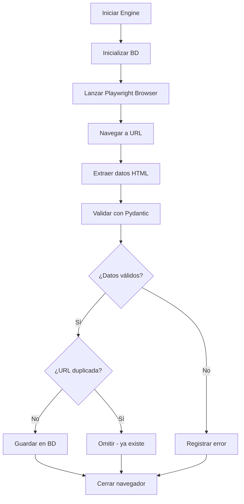

# 🔍 Labortrovilo

**Una herramienta alternativa para encontrar trabajos de IT fuera de los portales clásicos.**  
**Alia ilo por trovi laborojn, krom plej uzataj laborportaloj.**  
**An alternative tool to find IT jobs outside classic job portals.**

---

## 📖 Descripción / Priskribo / Description

**Labortrovilo** es una plataforma de scraping inteligente que extrae ofertas de trabajo de múltiples fuentes ATS (Applicant Tracking Systems) y las almacena en una base de datos estructurada. Utiliza Playwright para navegación web avanzada, SQLAlchemy para persistencia de datos y Pydantic para validación robusta.

**Labortrovilo** estas inteligenta skrapada platformo kiu ekstraktas laborofertojn de multaj ATS-fontoj (Applicant Tracking Systems) kaj stokas ilin en strukturita datumbazo. Ĝi uzas Playwright por altnivela retumado, SQLAlchemy por datuma persisteco kaj Pydantic por fortika validigo.

**Labortrovilo** is an intelligent scraping platform that extracts job offers from multiple ATS sources (Applicant Tracking Systems) and stores them in a structured database. It uses Playwright for advanced web navigation, SQLAlchemy for data persistence, and Pydantic for robust validation.

---

## ✨ Características Principales / Ĉefaj Trajtoj / Main Features

### 🎯 Tecnología / Teknologio / Technology
- ✅ **Python 3.13+** - Lenguaje principal / Ĉefa lingvo / Main language
- ✅ **Playwright for Python** - Web scraping moderno y confiable / Moderna kaj fidinda retskrapado / Modern and reliable web scraping
- ✅ **SQLAlchemy 2.0+** - ORM para gestión de base de datos / ORM por datumbaza administrado / ORM for database management
- ✅ **Pydantic 2.0+** - Validación de datos con tipos / Datumvalidigo kun tipoj / Type-safe data validation
- ✅ **SQLite** - Base de datos integrada / Integrita datumbazo / Embedded database
- ✅ **AsyncIO** - Programación asíncrona nativa / Nesinkrona programado / Native async programming

### 🔧 Funcionalidades / Funkcioj / Functionalities
- 🌐 **Scraping asíncrono** con Playwright para mejor rendimiento
- 🗄️ **Base de datos relacional** con tablas Jobs y Companies
- ✅ **Validación automática** de datos antes de inserción
- 🚫 **Prevención de duplicados** mediante URLs únicas
- 📊 **Seguimiento de empresas** con métricas de crecimiento
- 💰 **Extracción de salarios** (cuando disponible)
- 🏷️ **Stack tecnológico** identificado y limpio
- 📝 **Documentación bilingüe** (Español/Esperanto) en todo el código

---

## 📁 Estructura del Proyecto / Projekta Strukturo / Project Structure

```
labo🐍 ARCHIVOS PYTHON (Activos) / PYTHON DOSIEROJ (Aktivaj)
│   ├── engine.py              # Motor principal de scraping / Ĉefa skrapada motoro
│   ├── models.py              # Modelos de base de datos / Datumbazaj modeloj
│   ├── schemas.py             # Esquemas de validación Pydantic / Pydantic validigaj skemoj
│   ├── database.py            # Configuración de BD / Datumbaza agordado
│   ├── config.py              # Ajustes centralizados / Centra agordado
│   ├── playwright_config.py   # Configuración Playwright Python / Playwright Python agordado
│   ├── requirements.txt       # Dependencias Python / Python dependecoj
│   └── MIGRATION_NOTE.py      # Nota de migración a Python / Noto pri migrado al Python
│
├── 📝 CONFIGURACIÓN / AGORDADO / CONFIGURATION
│   ├── .env.example          # Variables de entorno ejemplo / Ekzempla medio-variabloj
│   ├── .gitignore            # Archivos ignorados / Ignoritaj dosieroj
│   └── README.md             # Documentación / Dokumentado
│
├── 📦 LEGACY (No se usan) / HEREDAĴO (Ne uzataj) / LEGACY (Not used)
│   ├── scrap.js              # ⚠️ Script legacy JavaScript
│   ├── scrapATS.js           # ⚠️ Queries legacy ATS
│   ├── playwright.config.js  # ⚠️ Config legacy JavaScript
│   └── package.json          # Solo para referencia / Nur por referenco
│
├── 🗂️ DIRECTORIOS / DOSIERUJOJ / DIRECTORIES
│   ├── venv/                 # Entorno virtual Python / Python virtuala medio
│   ├── tests/                # Pruebas legacy JS / Heredaĵaj testoj
│   └── playwright-report/    # Reportes / Raportoj
│
└── 🗄️ BASE DE DATOS / DATUMBAZO / DATABASE
    ├── playwright-report/    # Reportes de Playwright / Playwright raportoj
└── labortrovilo.db       # Base de datos SQLite / SQLite datumbazo
```

---

## ⚠️ NOTA IMPORTANTE / GRAVA NOTO / IMPORTANT NOTE

**Este proyecto usa Playwright con PYTHON exclusivamente.**  
**Ĉi tiu projekto uzas Playwright kun PYTHON ekskluzive.**  
**This project uses Playwright with PYTHON exclusively.**

Los archivos JavaScript (`scrap.js`, `playwright.config.js`) son legacy y no se utilizan. El motor de scraping está implementado completamente en Python.

---

## 🚀 Instalación / Instalado / Installation

### Prerrequisitos / Antaŭkondiĉoj / Prerequisites

- **Python 3.13+** (requerido / necesa / required)
- **Git**
- Conexión a internet / Interreta konekto / Internet connection
- **NO se requiere Node.js** / Node.js ne necesas / Node.js not required

### Paso 1: Clonar el repositorio / Paŝo 1: Kloni la deponejon / Step 1: Clone repository

```bash
git clone https://github.com/tu-usuario/labortrovilo.git
cd labortrovilo
```

### Paso 2: Crear entorno virtual / Paŝo 2: Krei virtualan medion / Step 2: Create virtual environment

```bash
python -m venv venv
```

### Paso 3: Activar entorno virtual / Paŝo 3: Aktivigi virtualan medion / Step 3: Activate virtual environment

**Windows:**
```bash
venv\Scripts\activate
```

**Linux/Mac:**
```bash
source venv/bin/activate
```

### Paso 4: Instalar dependencias / Paŝo 4: Instali dependecojn / Step 4: Install dependencies

```bash
pip install -r requirements.txt
```

### Paso 5: Instalar navegadores Playwright / Paŝo 5: Instali Playwright retumilojn / Step 5: Install Playwright browsers

```bash
playwright install chromium
```

### Paso 6: Configurar variables de entorno / Paŝo 6: Agordi medio-variablojn / Step 6: Configure environment variables

```bash
cp .env.example .env
# Editar .env según necesidades / Redakti .env laŭ bezonoj / Edit .env as needed
```

---

## 💻 Uso / Uzo / Usage

### Ejecución básica / Baza plenumado / Basic execution

```bash
python engine.py
```

### Personalizar URL objetivo / Personecigi celan URL / Customize target URL

Edita `engine.py` y modifica la URL en la función `main()`:

```python
# REEMPLAZAR CON URL REAL DE OFERTA DE TRABAJO
test_url = "https://boards.greenhouse.io/company/job/123456"
```

### Ejecutar con entorno virtual / Plenumi kun virtuala medio / Run with virtual environment

```bash
venv\Scripts\python.exe engine.py
```

---

## 🗄️ Esquema de Base de Datos / Datumbaza Skemo / Database Schema

### Tabla Companies / Tabelo Companies

| Campo / Campo / Field | Tipo / Tipo / Type | Descripción / Priskribo / Description |
|----------------------|-------------------|----------------------------------------|
| `id` | Integer (PK) | Identificador único / Unika identigilo / Unique identifier |
| `name` | String(255) | Nombre de empresa (único) / Kompania nomo (unika) / Company name (unique) |
| `growth_score` | Float | Puntuación de crecimiento / Kreska poentaro / Growth score |
| `industry` | String(100) | Industria / Industrio / Industry |
| `created_at` | DateTime | Fecha creación / Kredata / Created date |
| `updated_at` | DateTime | Fecha actualización / Ĝisdata / Updated date |

### Tabla Jobs / Tabelo Jobs

| Campo / Campo / Field | Tipo / Tipo / Type | Descripción / Priskribo / Description |
|----------------------|-------------------|----------------------------------------|
| `id` | Integer (PK) | Identificador único / Unika identigilo / Unique identifier |
| `title` | String(255) | Título del trabajo / Labortitolo / Job title |
| `company_id` | Integer (FK) | ID de empresa / Kompania ID / Company ID |
| `company_name` | String(255) | Nombre empresa (denorm.) / Kompania nomo (denorm.) / Company name (denorm.) |
| `raw_description` | Text | Descripción original / Originala priskribo / Original description |
| `cleaned_stack` | Text | Stack tecnológico limpio / Purigita teknologia stako / Cleaned tech stack |
| `salary_min` | Float | Salario mínimo / Minimuma salajro / Minimum salary |
| `salary_max` | Float | Salario máximo / Maksimuma salajro / Maximum salary |
| `source_url` | String(500) | URL fuente (única) / Fonta URL (unika) / Source URL (unique) |
| `posted_date` | DateTime | Fecha publicación / Publikigdata / Posted date |
| `scraped_at` | DateTime | Fecha extracción / Ekstraktdata / Scraped date |
| `updated_at` | DateTime | Fecha actualización / Ĝisdata / Updated date |

---

## 🎯 ATS Soportados / Subtenataj ATS / Supported ATS

El sistema está diseñado para trabajar con los siguientes sistemas ATS:

- 🟢 **Greenhouse** - `boards.greenhouse.io`
- 🟢 **Lever** - `jobs.lever.co`
- 🟢 **Workday** - `myworkdayjobs.com`
- 🟢 **SmartRecruiters** - `smartrecruiters.com`
- 🟢 **Workable** - `workable.com`
- 🟢 **BambooHR** - `bamboohr.com`
- 🟢 **Jobvite** - `jobvite.com`
- 🟢 **iCIMS** - `icims.com`
- 🟢 **Google Careers** - `careers.google.com`

---

## ⚙️ Configuración / Agordado / Configuration

### Variables de Entorno / Medio-variabloj / Environment Variables

Crea un archivo `.env` basado en `.env.example`:

```bash
# Base de datos / Datumbazo / Database
DATABASE_URL=sqlite:///./labortrovilo.db

# Playwright
PLAYWRIGHT_HEADLESS=true
PLAYWRIGHT_TIMEOUT=30000

# User Agent
USER_AGENT=Mozilla/5.0 (Windows NT 10.0; Win64; x64) AppleWebKit/537.36
```

---

## 🔧 Personalización / Personecigo / Customization

### Modificar selectores CSS / Modifi CSS-elektilojn / Modify CSS selectors

Edita el método `extract_job_data()` en `engine.py` para adaptar los selectores a tu sitio objetivo:

```python
# Extraer título / Ekstraki titolon
title = await self.page.locator('h1.job-title').first.text_content()

# Extraer empresa / Ekstraki kompanion
company_name = await self.page.locator('.company-name').first.text_content()
```

### Agregar campos personalizados / Aldoni proprajn kampojn / Add custom fields

1. Actualiza `models.py` para agregar columnas
2. Actualiza `schemas.py` para validación
3. Modifica `extract_job_data()` para extraer nuevos datos
4. Ejecuta migraciones de base de datos

---

## 📊 Flujo de Trabajo / Laborfluado / Workflow



---

## 🛠️ Desarrollo / Evoluigo / Development

### Ejecutar en modo debug / Plenumi en sencimiga reĝimo / Run in debug mode

Activa logs SQL editando `database.py`:

```python
engine = create_engine(
    settings.DATABASE_URL,
    echo=True,  # ← Cambiar a True / Ŝanĝi al True / Change to True
    ...
)
```

### Ver base de datos / Vidi datumbazon / View database

```bash
# Instalar SQLite viewer / Instali SQLite vidigilo
pip install sqlite-web

# Ejecutar / Plenumi / Run
sqlite_web labortrovilo.db
```

---

## 📝 Documentación del Código / Koda Dokumentado / Code Documentation

Todo el código incluye comentarios bilingües (Español/Esperanto):

```python
# Inicializar base de datos / Ekigi datumbazon
def init_db():
    # Crear todas las tablas / Krei ĉiujn tabelojn
    Base.metadata.create_all(bind=engine)
```

---

## 🐛 Solución de Problemas / Problemsolvado / Troubleshooting

### Error: ModuleNotFoundError: No module named 'playwright'

```bash
pip install playwright
playwright install chromium
```

### Error: SQLAlchemy incompatibility with Python 3.13

```bash
pip install --upgrade "SQLAlchemy>=2.0.35"
```

### Error: Base de datos bloqueada / Database is locked

La base de datos SQLite no soporta alta concurrencia. Considera migrar a PostgreSQL para producción.

---

## 🚧 Roadmap / Planita Evoluado / Planned Development

### Iteración 2: Inteligencia de Datos
- [ ] Procesamiento de lenguaje natural para descripción
- [ ] Extracción automática de stack tecnológico
- [ ] Clasificación de trabajos por nivel de experiencia
- [ ] Análisis de salarios y tendencias

### Iteración 3: Interfaz Web
- [ ] Frontend con React/Vue
- [ ] API REST con FastAPI
- [ ] Sistema de búsqueda y filtros
- [ ] Dashboards analíticos

### Iteración 4: Automatización
- [ ] Scraping programado (cron jobs)
- [ ] Notificaciones por email
- [ ] Integración con Telegram/Discord
- [ ] Sistema de alertas personalizadas

---

## 🤝 Contribución / Kontribui / Contributing

Las contribuciones son bienvenidas / Kontribuoj estas bonvenaj / Contributions are welcome!

1. Fork el proyecto / Forku la projekton / Fork the project
2. Crea tu rama (`git checkout -b feature/AmazingFeature`)
3. Commit tus cambios (`git commit -m 'Add some AmazingFeature'`)
4. Push a la rama (`git push origin feature/AmazingFeature`)
5. Abre un Pull Request

---

## 📄 Licencia / Permesilo / License

Este proyecto está bajo la licencia MIT. Ver archivo `LICENSE` para más detalles.

---

## 👤 Autor / Aŭtoro / Author

**Daniel** - [GitHub Profile](https://github.com/tu-usuario)

---

## 🙏 Agradecimientos / Dankespreskoj / Acknowledgments

- **Playwright Team** - Por la excelente herramienta de scraping
- **SQLAlchemy** - Por el ORM robusto
- **Pydantic** - Por la validación de datos
- **Comunidad Esperanto** - Por inspirar la documentación bilingüe

---

## 📞 Contacto / Kontakto / Contact

- 📧 Email: tu-email@ejemplo.com
- 💼 LinkedIn: [Tu Perfil](https://linkedin.com/in/tu-perfil)
- 🐦 Twitter: [@tu_usuario](https://twitter.com/tu_usuario)

---

<div align="center">

**Hecho con ❤️ por la comunidad de desarrolladores**  
**Farita kun ❤️ de la komunumo de programistoj**  
**Made with ❤️ by the developer community**

</div>


